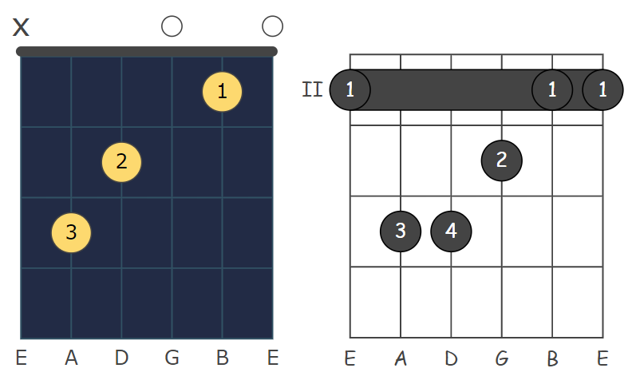

# ChordProject Diagrammer

A TypeScript frontend library for generating SVG chord diagrams from JSON specification.

Inspired by: https://github.com/tombatossals/react-chords.

- Typescript adaptation
- Remove lite mode
- Remove Capo
- Adapt barre drawing
- Add customization via settings
- Remove all hardcoded dimensions

## Overview

Generates SVG chord diagrams according to received specification.



## Usage

It's really easy to draw an SVG chord diagram:

```ts
// chord diagram definitions
const chordDiagram = new ChordDiagram({
	frets: [-1, 0, 2, 2, 1, 0],
	fingers: [0, 0, 2, 3, 1, 0],
	baseFret: 1,
});

// instrument definitions
const instrument = {
	strings: 6,
	fretsOnChord: 4,
	name: 'Guitar',
	tunings: ['E', 'A', 'D', 'G', 'B', 'E'],
};

const generator = new Diagrammer(); // create an instance of Diagrammer
var svg = generator.builder(chordDiagram, instrument); // build the svg
document.body.appendChild(svg); // add the svg in the html content (here the body)
```

A ChordDiagram is defined by:

- frets (array of numbers). Use 0 for open strings and -1 for muted strings. Frets must be relative to the base-fret.
- fingers (array of numbers). Use 0 for no finger. The fingers array length must match the frets array length. The fingers are optional
- base-fret (number)

You can customize the diagram by passing a Settings object in the Diagrammer constructor.
All of the settings has already a default value. You can change the desired settings.
You can change colors, sizes, visibility,... of each component.

#### Part of [ChordProject](https://chordproject.com/)
